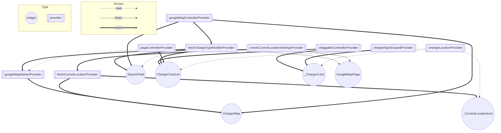

# Flutter Coding Challenge

## ビルドの下準備とビルド方法

1. libフォルダと同列階層に、dart_definesフォルダを作成し、そこに「dev.env」、「prod.env」ファイルを作成してください。
2. 上記ファイルに、以下のように、Google API Key、API Key をそれぞれ記載してください。(今回は、dev.envもprod.envも同じキーが入ります。)
```
flavor="dev"
GOOGLE_MAP_API_KEY="XXXXX"
ENECHANGE_API_KEY="XXXXX"
```
※ prod.envには、flavor="prod"を入れる。

3. デバッグ、リリースビルドは以下のコマンドをうち実行してください。
```
-- デバッグビルド
flutter run --dart-define-from-file=dart_defines/dev.env

-- リリースビルド
flutter run --release --dart-define-from-file=dart_defines/prod.env
```

## フォルダ構成
```

├── common
│     ├── const
│     ├── extention
│     ├── provider
│     └── widget
├── features
│     └── charger_spot
│          ├── model
│          ├── provider
│          └── repository
└── pages
      └── google_map_page
            ├── constant
            ├── provider
            ├── widget
            ├── google_map_page.dart
            └── google_map_page_body.dart

```

### commonフォルダ
アプリ全体で共通で使用するものを配置する。
今回は、const、extention、provider、widgetを配置。

### featuresフォルダ
機能単位でフォルダ分けを行う、アプリのコアとなるフォルダ。
関連するレイヤー(model、repository、provider)をできる限り近くに配置。

今回で言うと、charger_spotというモデルに関するレイヤー(model、repository、provider)をcharger_spotフォルダにまとめて配置している。
視認性の良さ、チーム開発のしやすさを目指している。

※ featuresフォルダに配置されているproviderは、後述するpagesフォルダ内で直接使用可能。

### pagesフォルダ

画面に関するものが置かれるフォルダ。
Scaffoldを含んだメインのページ(google_map_page.dart)を起点とし、bodyのWidget(google_map_page_body.dart)別フォルダに切り分け。

components: そのページ内で使用するコンポーネント群
constant: そのページ内で使用する定数
provider: そのページ内で使用するprovider (View Model的な立ち位置に近い)、featuresで定義したproviderのデータを画面に適したものに分割する役割もあり。

※ pagesフォルダを、featuresに配置しなかった理由は、複数のfeaturesをpagesが使用する可能性があるためトップレベルでフォルダを分割。

## riverpod_graph
riverpod_graphを導入しました。

### メリット
- どのproviderがどこで使用されているか確認しやすい。
- providerが循環参照していないか確認できる。



## その他

### scoped providerについて
Widgetにconstを付与するために、Widgetの引数からデータをバケツリレーするのではなく、provider scopedを使用してデータを渡すようにしています。


